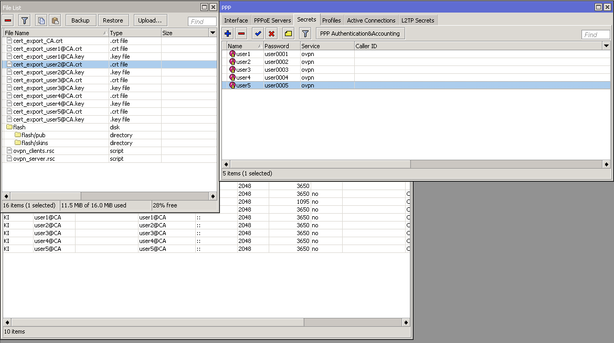

# MikroTik_OpenVPN_Server_Setup

MikroTik (Router OS) OpenVPN Server Setup

## Server Setup in Mikrotik Router

Upload both files `ovpn_server.rsc` and `ovpn_clients.rsc`. To import any `.rsc` file open a terminal and write `import file=XXXXX` where XXXXX is the name of the file to import.

First import `ovpn_server.rsc` that will make the following actions:

+ Create the CA and Server certificates  
+ Create an IP pool that will be assigned to any client connected to the VPN
+ Setup a VPN profile linked to the ip pool created
+ Setup RouterOS's OpenVPN native server
+ Add a firewall route in order to accept traffic to the OpenVPN server

First import `ovpn_clients.rsc` that will make the following actions for each user:

+ Create user secret  
+ Generate and sign user's certificate
+ Export user's client certificate and key


At the end it will also export the CA certificate neede for the client configuration file.




## Client Setup in Mikrotik Router

Download all client certificates to your local machine and put them in the `/certificates` folder
then run:

**Each users's password is user000X where X is the user number**

Remove passwords from key files with the following script:
```
$sh ./sign_certs.sh
Signing cert from user 1
Enter pass phrase for certificates/cert_export_user1@CA.key:
writing RSA key
...
```
Go to `create_config.sh` and add the following variables `PUBLIC_IP` (your router's public ip address) and `PUBLIC_PORT` (OpenVPN's server exposed port).

Generate `.ovpn` config files with following script:

```
$sh create_config.sh
mkdir: configs: File exists
Creating user 1 dir...
Copying user cert and key...
Creating user auth...
Creating config file...
...
```

Now in `/configs` folder you will find one folder with each user and their config files needed to configure the client


## Resources
+ [OpenVPN Server and certificate management on MikroTik](https://gist.github.com/SmartFinn/8324a55a2020c56b267b)
+ [OpenVPN Mikrotik Wiki](https://wiki.mikrotik.com/wiki/OpenVPN)
+ [MikroTik OpenVPN server and Windows OpenVPN client (LAB demo)](https://www.youtube.com/watch?v=ucifDsLHj6c)

